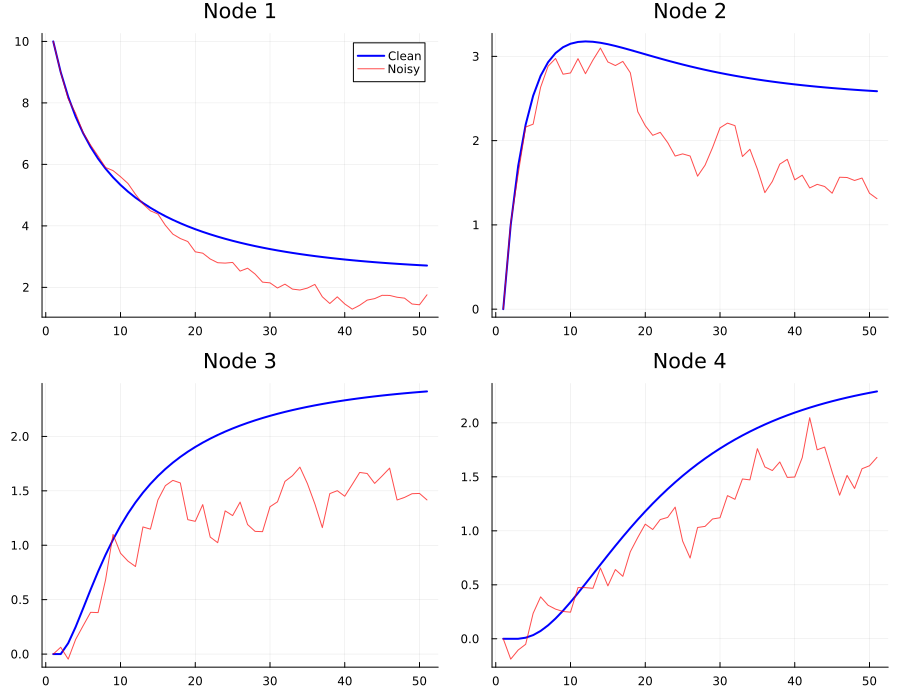

# GraphStoch

Stochastic Differential Equation solver on graph topology for 
noise robust node state prediction. Julia core engine + Python API.

## Why GraphStoch?

Real-world graph data - social networks, crypto transaction graphs, 
brain connectivity networks looks powerful, but is riddled with 
random noise. Standard Graph Neural Networks (GNNs) don't explicitly 
model this noise, so they end up learning it as if it were signal.

**Three domains, one shared problem:**

 **Social networks**: users post erratically due to hype, mood, or 
  randomness that doesn't reflect their long term behavior. GNNs 
  treat this one off noise as signal, degrading recommendations and 
  community detection.
- **Crypto transaction networks**: wallets generate a mix of regular 
  activity, bot traffic, and pure noise (test transfers, airdrops, 
  wash trading). Without separating noise from signal, real threats 
  get diluted and harmless wallets get over-flagged.
- **Brain / neuron networks**: neuron activation data is full of 
  sensor noise and biological jitter. If a model can't separate this 
  from the stable underlying pattern, clinically important structure 
  gets lost in the noise.

**The core issue**: every node's behavior is a mix of a slow, stable 
pattern (signal) and fast, random fluctuation (noise). Standard GNNs 
have no explicit mathematical model for this separation they 
assume observed data is roughly clean, so noise leaks directly into 
the learned weights.

**GraphStoch's approach**: treat each node's state as a stochastic 
process. Explicitly simulate both graph diffusion (via the Laplacian) 
and random noise (via Brownian motion), so the model can distinguish 
long term structure from momentary fluctuation instead of 
conflating the two.

## The Math

### Graph Laplacian (L = D - A)

The Laplacian measures how different each node is from its 
neighbors, and provides the mechanism to smooth that difference out 
over the graph.

- **Adjacency matrix (A)**: encodes which nodes are connected.
- **Degree matrix (D)**: diagonal matrix where D[i,i] = number of 
  connections node i has.
- **Laplacian**: L = D - A

Given a state vector x over the graph, Lx measures how far each 
node's value is from its neighbors' values. Nodes close to their 
neighbors have small Laplacian values; outliers have large ones.

This makes -Lx a diffusion operator: repeatedly applying it pulls 
every node's value toward the average of its neighbors, smoothing 
out noisy, disconnected values into a stable pattern.

### The Stochastic Differential Equation

We model each node's state evolution as:

    dX_t = -L X_t dt + σ dW_t

This says node states change over time due to two combined effects:

**1. Deterministic part: -L X_t dt**

- X_t is the vector of all node values at time t.
- L is the graph Laplacian, capturing how different each node is 
  from its neighbors.
- -L X_t dt pulls every node's value a little closer to its 
  neighbors' average at each instant.

This part is fully predictable: given X_t and L, you know exactly 
which direction the system moves next. This is the diffusion / 
smoothing behavior.

**2. Noise part: σ dW_t**

- W_t is a Wiener process (Brownian motion) continuous time, pure 
  random noise.
- dW_t is a tiny random increment of that noise.
- σ controls the noise strength larger σ means bigger random jitter.

This term tells the model: "real data has randomness, so we add a 
stochastic term explicitly instead of ignoring it."

**Put together**: node states drift toward their neighborhood's 
average, but the path isn't a straight line it's a random walk 
around that trend, and we model both parts mathematically instead 
of averaging them away.

### Euler-Maruyama: from continuous math to discrete code

Computers can't simulate continuous time they work in discrete 
steps. Euler Maruyama approximates the SDE by breaking it into small 
time steps:

    X_{t+Δt} = X_t - L X_t · Δt + σ√Δt · Z

Where:
- Δt is a small time step (e.g. 0.01, 0.1)
- Z is a standard normal random vector, sampled fresh at each step
- √Δt correctly scales the noise to match Brownian motion's 
  statistical properties

**Deterministic part in code**: at each step, compute -L X_t, scale 
by Δt, and add to X_t. This is pure matrix multiplication - fully 
predictable.

**Noise part in code**: at each step, sample a random vector Z 
(`randn` in Julia), scale it by σ√Δt, and add it to X_t. This 
injects small random jumps that approximate continuous Brownian 
motion.

We implement this from scratch (no third-party SDE libraries) to 
show the mechanics explicitly rather than treating the solver as a 
black box.

## Results So Far

Simulating a 4 node chain graph with an initial spike at node 1, 
comparing clean diffusion vs. the stochastic (noisy) version:

Even with random noise injected at every step, the noisy trajectory 
(red) tracks the same overall trend as the clean deterministic 
diffusion (blue) demonstrating that the Laplacian's structural pull 
dominates over random fluctuation.

## Benchmark: GraphStoch vs Naive Neighbor Averaging

We compared GraphStoch's diffusion process against a naive GNN-style 
baseline (iterative neighbor averaging) on a 30-node random graph 
with heavy noise (σ=2.0 relative to signal scale).

**Key finding**: naive averaging converges quickly but plateaus at a 
suboptimal error (~0.237 MSE) because repeated unweighted averaging 
over-smooths the graph nodes lose their individual structure and 
collapse toward a single average value. GraphStoch continues to 
improve with more steps (0.36 -> 0.20 -> 0.17 MSE) since the 
Laplacian based dynamics preserve more of the underlying graph 
structure.

We also found that step size (dt) is critical for the Euler-Maruyama 
solver: dt=0.1 gives stable convergence, but dt≥0.2 causes the 
solution to diverge numerically - a known stability constraint of 
Euler-based SDE solvers confirming the theory behind why small step 
sizes are required.

| Iterations | Naive MSE | GraphStoch MSE (dt=0.1) |
|---|---|---|
| 3  | 0.473 | 1.118 |
| 5  | 0.285 | 0.717 |
| 10 | 0.233 | 0.363 |
| 20 | 0.237 | 0.201 |
| 50 | 0.238 | **0.173** |

GraphStoch requires more iterations to converge but avoids the 
over smoothing plateau naive averaging suffers from at the cost of 
slower initial convergence.

## Solver Comparison: Euler-Maruyama vs SRA3

The from-scratch Euler-Maruyama (EM) implementation above is educational 
and transparent, but as a fixed-step method it has a hard numerical 
stability limit tied to the largest eigenvalue of the graph Laplacian 
(`dt < 2/λ_max`). Exceeding that limit causes the solution to diverge.

Since the noise term in this model is additive (σ is constant, not 
state-dependent), the equation is a good fit for **SRA3** - a Stochastic 
Runge-Kutta method with adaptive step size, available in 
[StochasticDiffEq.jl](https://github.com/SciML/StochasticDiffEq.jl) 
(part of the SciML ecosystem). This suggestion came from 
[Chris Rackauckas](https://github.com/ChrisRackauckas) after sharing 
early results with the SciML community.

**Test setup**: 4-node chain graph, X0 = [10, 0, 0, 0], σ = 0.5, 
dt = 0.7 (above this graph's stability limit of ~0.586).

| Method | Step size | Final state | Result |
|---|---|---|---|
| Euler-Maruyama (from scratch) | Fixed, dt=0.7 | [547, -1309, 1314, -541] | Diverged |
| SRA3 (StochasticDiffEq.jl) | Adaptive | [2.89, 2.75, 2.86, 2.63] | Stable, converged |

SRA3's adaptive stepping automatically takes smaller internal steps when 
needed, without the user having to hand-pick a safe dt. Going forward, 
SRA3 is used as the primary solver for production runs, while the 
from-scratch EM implementation is kept as an explicit, interpretable 
baseline for illustrating the stability trade-off.

**Note**: this result demonstrates instability at one specific step size 
on one specific graph - it is not a claim that SRA3 is universally better 
in all regimes, only that it is well-suited for additive-noise SDEs like 
this one.

## Status

- [x] Phase 1: Graph Laplacian construction (from scratch)
- [x] Phase 2: Euler-Maruyama SDE solver (from scratch)
- [x] Phase 3: Python wrapper (juliacall) - `GraphSDE` class with 
      `.simulate()`, `.denoise()`, `.stable_dt()` methods
- [x] Phase 4: Benchmark vs standard GNN on noisy data
- [x] Phase 5: SRA3 adaptive solver integration (StochasticDiffEq.jl) 
      for improved numerical stability

## Tech Stack

- **Julia**: core simulation engine
- **StochasticDiffEq.jl**: adaptive SRA3 solver for additive-noise SDEs
- **Python**: wrapper API, via juliacall (`GraphSDE` class)
- **Plots.jl**: visualization

## License

MIT