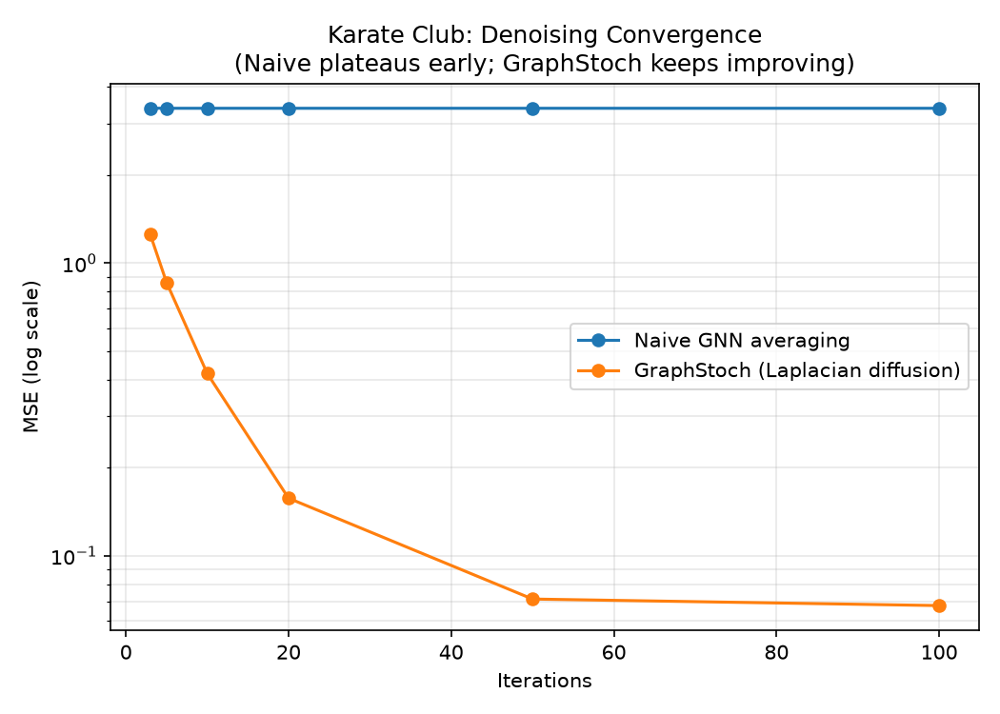
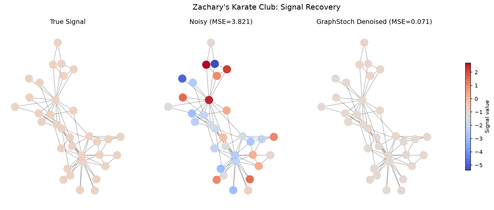

# GraphStoch

Stochastic Differential Equation solver on graph topology for
noise robust node state prediction. Julia core engine + Python API.

## Why GraphStoch?

Real world graph data - social networks, crypto transaction graphs,
brain connectivity networks looks powerful, but is riddled with
random noise. Standard Graph Neural Networks (GNNs) don't explicitly
model this noise, so they end up learning it as if it were signal.

**Three domains, one shared problem:**

- **Social networks**: users post erratically due to hype, mood, or
  randomness that doesn't reflect their long term behavior. GNNs
  treat this one off noise as signal, degrading recommendations and
  community detection.
- **Crypto transaction networks**: wallets generate a mix of regular
  activity, bot traffic, and pure noise (test transfers, airdrops,
  wash trading). Without separating noise from signal, real threats
  get diluted and harmless wallets get over-flagged.
- **Brain / neuron networks**: neuron activation data is full of
  sensor noise and biological jitter. If a model can't separate this
  from the stable underlying pattern, clinically important structure
  gets lost in the noise.

**The core issue**: every node's behavior is a mix of a slow, stable
pattern (signal) and fast, random fluctuation (noise). Standard GNNs
have no explicit mathematical model for this separation - they
assume observed data is roughly clean, so noise leaks directly into
the learned weights.

**GraphStoch's approach**: treat each node's state as a stochastic
process. Explicitly simulate both graph diffusion (via the Laplacian)
and random noise (via Brownian motion), so the model can distinguish
long term structure from momentary fluctuation instead of
conflating the two.

## The Math

### Graph Laplacian (L = D - A)

The Laplacian measures how different each node is from its
neighbors, and provides the mechanism to smooth that difference out
over the graph.

- **Adjacency matrix (A)**: encodes which nodes are connected.
- **Degree matrix (D)**: diagonal matrix where D[i,i] = number of
  connections node i has.
- **Laplacian**: L = D - A

Given a state vector x over the graph, Lx measures how far each
node's value is from its neighbors' values. Nodes close to their
neighbors have small Laplacian values; outliers have large ones.

This makes -Lx a diffusion operator: repeatedly applying it pulls
every node's value toward the average of its neighbors, smoothing
out noisy, disconnected values into a stable pattern.

### The Stochastic Differential Equation

We model each node's state evolution as:

    dX_t = -L X_t dt + σ dW_t

This says node states change over time due to two combined effects:

**1. Deterministic part: -L X_t dt**

- X_t is the vector of all node values at time t.
- L is the graph Laplacian, capturing how different each node is
  from its neighbors.
- -L X_t dt pulls every node's value a little closer to its
  neighbors' average at each instant.

This part is fully predictable: given X_t and L, you know exactly
which direction the system moves next. This is the diffusion /
smoothing behavior.

**2. Noise part: σ dW_t**

- W_t is a Wiener process (Brownian motion) - continuous time, pure
  random noise.
- dW_t is a tiny random increment of that noise.
- σ controls the noise strength - larger σ means bigger random jitter.

This term tells the model: "real data has randomness, so we add a
stochastic term explicitly instead of ignoring it."

**Put together**: node states drift toward their neighborhood's
average, but the path isn't a straight line - it's a random walk
around that trend, and we model both parts mathematically instead
of averaging them away.

### Euler-Maruyama: from continuous math to discrete code

Computers can't simulate continuous time - they work in discrete
steps. Euler-Maruyama approximates the SDE by breaking it into small
time steps:

    X_{t+Δt} = X_t - L X_t · Δt + σ√Δt · Z

Where:
- Δt is a small time step (e.g. 0.01, 0.1)
- Z is a standard normal random vector, sampled fresh at each step
- √Δt correctly scales the noise to match Brownian motion's
  statistical properties

**Deterministic part in code**: at each step, compute -L X_t, scale
by Δt, and add to X_t. This is pure matrix multiplication - fully
predictable.

**Noise part in code**: at each step, sample a random vector Z
(`randn` in Julia), scale it by σ√Δt, and add it to X_t. This
injects small random jumps that approximate continuous Brownian
motion.

We implement this from scratch (no third-party SDE libraries) to
show the mechanics explicitly rather than treating the solver as a
black box.

## Results So Far

Simulating a 4 node chain graph with an initial spike at node 1,
comparing clean diffusion vs. the stochastic (noisy) version:

Even with random noise injected at every step, the noisy trajectory
(red) tracks the same overall trend as the clean deterministic
diffusion (blue) - demonstrating that the Laplacian's structural pull
dominates over random fluctuation.

## Benchmark: GraphStoch vs Naive Neighbor Averaging

We compared GraphStoch's diffusion process against a naive GNN-style
baseline (iterative neighbor averaging) on a 30-node random graph
with heavy noise (σ=2.0 relative to signal scale).

**Key finding**: naive averaging converges quickly but plateaus at a
suboptimal error (~0.237 MSE) because repeated unweighted averaging
over-smooths the graph - nodes lose their individual structure and
collapse toward a single average value. GraphStoch continues to
improve with more steps (0.36 -> 0.20 -> 0.17 MSE) since the
Laplacian-based dynamics preserve more of the underlying graph
structure.

We also found that step size (dt) is critical for the Euler-Maruyama
solver: dt=0.1 gives stable convergence, but dt≥0.2 causes the
solution to diverge numerically - a known stability constraint of
Euler-based SDE solvers, confirming the theory behind why small step
sizes are required.

| Iterations | Naive MSE | GraphStoch MSE (dt=0.1) |
|---|---|---|
| 3  | 0.473 | 1.118 |
| 5  | 0.285 | 0.717 |
| 10 | 0.233 | 0.363 |
| 20 | 0.237 | 0.201 |
| 50 | 0.238 | **0.173** |

GraphStoch requires more iterations to converge but avoids the
over-smoothing plateau naive averaging suffers from, at the cost of
slower initial convergence.

## Solver Comparison: Euler-Maruyama vs SRA3

The from-scratch Euler-Maruyama (EM) implementation above is educational
and transparent, but as a fixed-step method it has a hard numerical
stability limit tied to the largest eigenvalue of the graph Laplacian
(`dt < 2/λ_max`). Exceeding that limit causes the solution to diverge.

Since the noise term in this model is additive (σ is constant, not
state-dependent), the equation is a good fit for **SRA3** - a Stochastic
Runge-Kutta method with adaptive step size, available in
[StochasticDiffEq.jl](https://github.com/SciML/StochasticDiffEq.jl)
(part of the SciML ecosystem). This suggestion came from
[Chris Rackauckas](https://github.com/ChrisRackauckas) after sharing
early results with the SciML community.

**Test setup**: 4-node chain graph, X0 = [10, 0, 0, 0], σ = 0.5,
dt = 0.7 (above this graph's stability limit of ~0.586).

| Method | Step size | Final state | Result |
|---|---|---|---|
| Euler-Maruyama (from scratch) | Fixed, dt=0.7 | [547, -1309, 1314, -541] | Diverged |
| SRA3 (StochasticDiffEq.jl) | Adaptive | [2.89, 2.75, 2.86, 2.63] | Stable, converged |

SRA3's adaptive stepping automatically takes smaller internal steps when
needed, without the user having to hand-pick a safe dt. Going forward,
SRA3 is used as the primary solver for production runs, while the
from-scratch EM implementation is kept as an explicit, interpretable
baseline for illustrating the stability trade-off.

**Note**: this result demonstrates instability at one specific step size
on one specific graph - it is not a claim that SRA3 is universally better
in all regimes, only that it is well-suited for additive-noise SDEs like
this one.

## Real Dataset Benchmark: Zachary's Karate Club

All benchmarks so far used synthetic Erdos-Renyi random graphs. To test
GraphStoch on something real and citable, we used
[Zachary's Karate Club](https://en.wikipedia.org/wiki/Zachary%27s_karate_club) -
a well-known social network of 34 real people (34 nodes, 78 edges),
collected in the 1970s, available built-in via `networkx.karate_club_graph()`.

**Setup**: a synthetic "true signal" (representing something like an
influence/activity score) was generated by diffusing a random seed with
GraphStoch itself, then heavy observation noise (σ=2.0) was added on top.
Both naive neighbor averaging and GraphStoch were then used to try to
recover the true signal from the noisy observations.

**Important lesson learned**: real graphs with high-degree "hub" nodes have
a much tighter stability limit than simple toy graphs. For this graph,
`stable_dt()` returned only 0.0384 (vs ~0.586 for the earlier 4-node chain).
Hardcoding a fixed dt (as done in earlier benchmarks) caused a silent,
catastrophic explosion here (values blew up to ~10^83). The fix, and the
general principle going forward: **always derive dt from the graph's own
Laplacian eigenvalues** (we use 50% of `stable_dt()` as a safety margin)
rather than assuming one fixed value works across different graph structures.

### Results

| | MSE |
|---|---|
| Raw noisy data | 3.8211 |
| Naive GNN averaging | 3.3835 |
| **GraphStoch denoising** | **0.0712** |

GraphStoch achieves roughly **54x lower error** than naive averaging on
this real network.

### Convergence across iterations

| Iterations | Naive MSE | GraphStoch MSE |
|---|---|---|
| 3   | 3.3861 | 1.2519 |
| 5   | 3.3837 | 0.8591 |
| 10  | 3.3835 | 0.4199 |
| 20  | 3.3835 | 0.1574 |
| 50  | 3.3835 | 0.0712 |
| 100 | 3.3835 | 0.0676 |

Naive averaging plateaus almost immediately (~3.38 MSE) on this real
network - likely because a few very high-degree "hub" members (e.g. the
instructor/president nodes in the real Karate Club social structure) cause
naive 1-hop averaging to over-smooth badly. GraphStoch's Laplacian-based
diffusion continues improving steadily instead of collapsing early.

**Honest caveat**: the dt used for GraphStoch here is very small (~0.0192)
due to the stability constraint on this graph, while naive averaging's
"iterations" are unitless hops. This means iteration count isn't directly
comparable as a measure of total diffusion "time" between the two methods -
the comparison above is on final achievable accuracy, not on time-matched
convergence speed.

## Real Dataset Benchmark: Cora, Citeseer & PubMed - Denoising as GNN Preprocessing

The Karate Club benchmark above tests pure signal recovery on a small graph.
To see how GraphStoch holds up at larger scale and against learned models, we
tested it on two standard citation-network datasets -
[Cora](https://relational.fit.cvut.cz/dataset/CORA) (2,708 nodes, 1,433
features, 7 classes) and [Citeseer](https://linqs.org/datasets/#citeseer-doc-classification)
(3,327 nodes, 3,703 features, 6 classes) - loaded via `torch_geometric`'s
`Planetoid` loader, and compared against three widely used GNN architectures:
GCN, GraphSAGE, and GAT.

**Framing**: Cora and Citeseer are node-*classification* datasets, while
GraphStoch is a denoising method for continuous signal recovery - directly
comparing GraphStoch's MSE to a classifier's accuracy would be an
apples-to-oranges comparison. Instead we frame this as **denoising as GNN
preprocessing**:

1. Inject synthetic Gaussian noise into the node features.
2. Compare noisy features → Logistic Regression vs. GraphStoch-denoised
   features → Logistic Regression, to isolate GraphStoch's own contribution.
3. Compare both against noisy features fed directly into end-to-end trained
   GCN / GraphSAGE / GAT models - i.e. "let the GNN learn to handle the noise
   itself."

**Setup**: features were row-normalized via `T.NormalizeFeatures()`, which is
standard preprocessing for these bag-of-words datasets - GNN baselines run
without it underperform published benchmarks by several points, so this is a
required step rather than an optional tweak. GNNs were trained with Adam
(lr=0.01, weight_decay=5e-4) and validation-based early stopping (patience=50,
max 300 epochs). Three noise levels (0.1x / 0.5x / 1.0x feature std) were each
run across 10 random seeds, with paired t-tests comparing GraphStoch-denoised
features + Logistic Regression against each GNN.

### Cora results

| Noise level | LogReg (noisy) | LogReg (GraphStoch-denoised) | GCN | GraphSAGE | GAT |
|---|---|---|---|---|---|
| Low    | 0.5726 | 0.7394 | **0.8152** | 0.7884 | **0.8249** |
| Medium | 0.5510 | 0.7402 | **0.8096** | 0.7921 | **0.8187** |
| Heavy  | 0.4893 | 0.7286 | **0.7927** | 0.7667 | **0.8006** |

All nine paired comparisons (3 noise levels × 3 GNNs) are statistically
significant (p<0.0001) - and the GNNs win every single one, by 4 to 9
percentage points.

### Citeseer results

| Noise level | LogReg (noisy) | LogReg (GraphStoch-denoised) | GCN | GraphSAGE | GAT |
|---|---|---|---|---|---|
| Low    | 0.6185 | **0.7225** | 0.6995 | 0.6978 | 0.7169 |
| Medium | 0.6072 | **0.7198** | 0.7071 | 0.6899 | 0.7104 |
| Heavy  | 0.5703 | **0.7097** | 0.6977 | 0.6815 | 0.6999 |

Here the result flips: GraphStoch-denoised features + Logistic Regression
win 8 of 9 comparisons (p<0.05), by 1 to 3 percentage points. The one
exception - vs. GAT at low noise - is not statistically significant.

### PubMed results

To help disentangle *why* GraphStoch wins on Citeseer but loses on Cora, we
extended the same experiment to a third citation dataset,
[PubMed](https://linqs.org/datasets/#pubmed-diabetes) (19,717 nodes, 500
features, 3 classes) - identical setup (normalized features, same GNN
hyperparameters, same 3 noise levels × 10 seeds, same paired t-tests).

| Noise level | LogReg (noisy) | LogReg (GraphStoch-denoised) | GCN | GraphSAGE | GAT |
|---|---|---|---|---|---|
| Low    | 0.7321 | 0.7614 | **0.7899** | 0.7703 | 0.7775 |
| Medium | 0.7146 | 0.7539 | **0.7800** | 0.7638 | 0.7718 |
| Heavy  | 0.6529 | 0.7260 | **0.7593** | 0.7335 | 0.7557 |

On PubMed, GNNs win the direction in all 9 comparisons, and 8 of 9 are
statistically significant (p<0.05) - the one exception (GraphSAGE at heavy
noise, p=0.35) is not significant, but the mean difference still favors GNN.
This matches Cora's pattern, not Citeseer's.

**Why this matters - a structural comparison across all three datasets:**
we also computed six candidate graph/feature properties (connectivity,
algebraic connectivity λ₂, feature-dim/node ratio, edge homophily, average
degree, feature sparsity) for all three datasets
(`python/compute_dataset_properties.py`). On Cora and Citeseer, all six
properties moved together - Citeseer was more fragmented, lower λ₂, lower
homophily, sparser, and had a higher feature-dim/node ratio, so the six
hypotheses were completely confounded with only two datapoints. PubMed
breaks this bundle: it is fully connected with the *highest* λ₂, average
degree, and homophily close to Cora's of all three datasets - by those four
measures it looks "Cora-like or better," not Citeseer-like. But on
feature-dim/node ratio and feature sparsity specifically, PubMed is even
more extreme than Citeseer.

PubMed's classification result (GNNs win, Cora's pattern) tracks its
connectivity / λ₂ / homophily / average degree profile, not its feature-dim
ratio or sparsity profile. This is evidence that **graph structural
properties (connectivity, algebraic connectivity, homophily, degree) are
more likely to drive the GraphStoch-vs-GNN flip than feature-level
properties (dimensionality ratio, sparsity)** - though with three datapoints
this is still a correlational, not causal, conclusion. Isolating the true
driver among these four remaining structural candidates requires a
controlled synthetic-graph sweep (varying one property at a time while
holding the others fixed), which is the planned next step.

**Honest conclusion**: GraphStoch's standing relative to learned GNNs is
**dataset-dependent**, not a clean win or loss either way. On Cora and
PubMed, GNNs clearly outperform GraphStoch-denoised-features-plus-LogReg.
On Citeseer, GraphStoch-denoised-features-plus-LogReg holds a modest but
consistent edge over all three GNN baselines. We are not claiming GraphStoch
"beats" GNNs in general - the takeaway is that a fixed, non-learned,
training-free denoising step is a genuinely competitive preprocessing
baseline on some graphs and a clearly weaker one on others, and that this
variation itself points toward specific structural graph properties
(connectivity, algebraic connectivity, homophily, degree) as the more
likely explanation, rather than feature-level properties.

*Methodological note: an earlier version of the Cora/Citeseer experiment,*
*run without `T.NormalizeFeatures()`, produced misleadingly strong results*
*for GraphStoch on both datasets. That version was discarded once the*
*missing normalization was identified as the cause - row-normalization is*
*required for these bag-of-words features to get GNN baselines that match*
*published accuracy.*

## Status

- [x] Phase 1: Graph Laplacian construction (from scratch)
- [x] Phase 2: Euler-Maruyama SDE solver (from scratch)
- [x] Phase 3: Python wrapper (juliacall) - `GraphSDE` class with
      `.simulate()`, `.denoise()`, `.stable_dt()` methods
- [x] Phase 4: Benchmark vs standard GNN on noisy data
- [x] Phase 5: SRA3 adaptive solver integration (StochasticDiffEq.jl)
      for improved numerical stability
- [x] Phase 6: Real dataset benchmark (Zachary's Karate Club) with
      dynamically-derived stable dt and denoising visualizations
- [x] Phase 7: Cora & Citeseer benchmarks - GraphStoch-denoised features
      as GNN preprocessing, compared against GCN / GraphSAGE / GAT
- [x] Phase 8: PubMed benchmark - confirms Cora's pattern (GNNs win),
      helps disentangle structural vs feature-level explanations for the
      Cora/Citeseer flip

## Tech Stack

- **Julia**: core simulation engine
- **StochasticDiffEq.jl**: adaptive SRA3 solver for additive-noise SDEs
- **Python**: wrapper API, via juliacall (`GraphSDE` class)
- **Plots.jl**: visualization
- **NetworkX**: real-world graph datasets (Zachary's Karate Club)
- **Matplotlib**: Karate Club visualizations
- **PyTorch Geometric**: Cora/Citeseer dataset loading and GNN baselines
  (GCN, GraphSAGE, GAT)
- **scikit-learn**: Logistic Regression baseline for the denoising-as-
  preprocessing comparison

## License

MIT